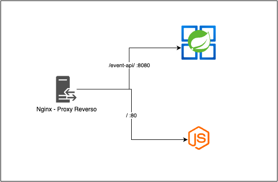

# README - Sistema de Gestão de Eventos

Este repositório contém a implementação de um sistema para gerenciar eventos com datas de vigência (data inicial e data final). A principal funcionalidade do sistema é permitir o cadastro, visualização, atualização e inativação automática de eventos com base em sua data de vigência. Os eventos são automaticamente ativados na data de início e desativados na data final por intermédio de dois schedule jobs.

Foi realizado o deploy da aplicação em cloud, podendo ser testado em:

- Documentação da API: http://146.190.174.81/event/swagger-ui/index.html

- Aplicação: http://146.190.174.81/

Autor: Wagner Palmeira
