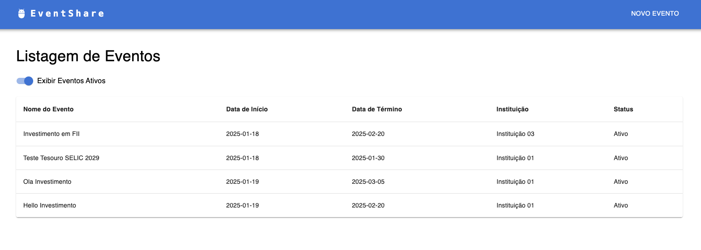

# README - Sistema de Gestão de Eventos - FRONTEND



Aplicação front do sistema de gestão de eventos. As funcionalidades a seguir podem ser verificadas:

- Visualização de eventos ativos e inativos
- Criar novos eventos

## Configuração

Instalar dependências:

```shell
npm install
```

Rodar server:

```shell
npm run dev
```