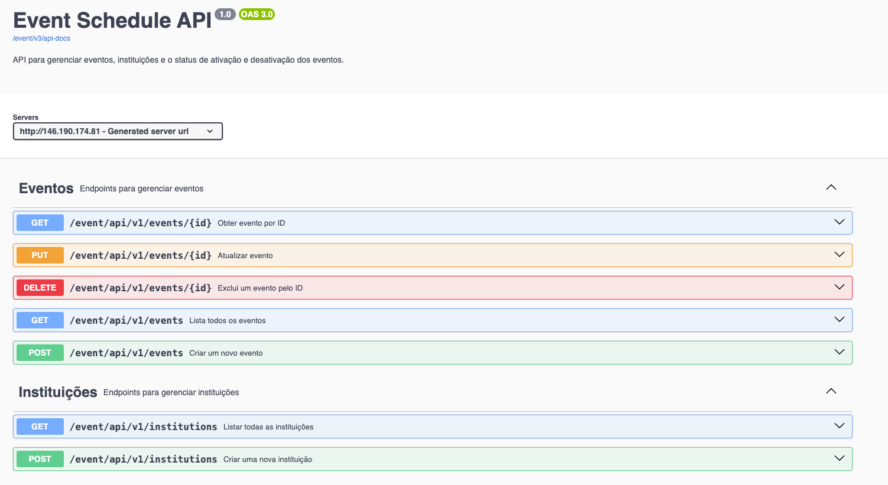

# README - Sistema de Gestão de Eventos - BACKEND




Descrição
O Sistema de Gestão de Eventos é uma aplicação backend desenvolvida para gerenciar o agendamento de eventos. Através deste sistema, é possível registrar eventos com suas respectivas datas e horas e, com isso, monitorar esses eventos para garantir que, ao atingir a data e hora definidas, o status do evento seja automaticamente alterado para ativo.

## O sistema utiliza as seguintes tecnologias:

- Spring Framework: Uma plataforma robusta para desenvolvimento de aplicações Java empresariais, proporcionando fácil integração e escalabilidade.
- PostgreSQL: Banco de dados relacional utilizado para armazenar as informações dos eventos, como data, hora, status e outros dados relevantes.
- JUnit: Framework de testes unitários utilizado para garantir que a aplicação funcione corretamente e atenda aos requisitos estabelecidos.
- Mockito: Framework de mocking utilizado para criar objetos simulados (mocks) durante os testes, facilitando a criação de cenários controlados e garantindo maior precisão nos testes.
- Swagger: Ferramenta para documentação e testes da API, permitindo que desenvolvedores e equipes interajam de forma fácil e compreensível com o serviço backend.

## Funcionalidade Principal
- O sistema oferece a funcionalidade de agendar eventos, associando a cada evento uma data e hora de execução. O sistema realiza a seguinte operação crítica:

- Alteração automática do status para "ativo": A cada meia-noite, o sistema verifica se algum evento tem sua data e hora atingida. Caso a data de um evento tenha sido alcançada, o status deste evento é alterado para ativo, indicando que o evento está em andamento ou realizado.

### Processos principais:
- Cadastro de Evento: O usuário pode cadastrar novos eventos no sistema informando dados como: nome do evento, descrição, data e hora.
- Verificação Automática: Todos os dias, ao meia-noite, o sistema verifica se a data e hora de algum evento foi atingida. Caso positivo, o status do evento é alterado para ativo.
API Documentada com Swagger: A API está documentada com Swagger, permitindo fácil interação e visualização de como os endpoints funcionam.

# Configurando Aplicação com docker

```shell
docker-compose -f docker-compose-dev.yml up -d
```